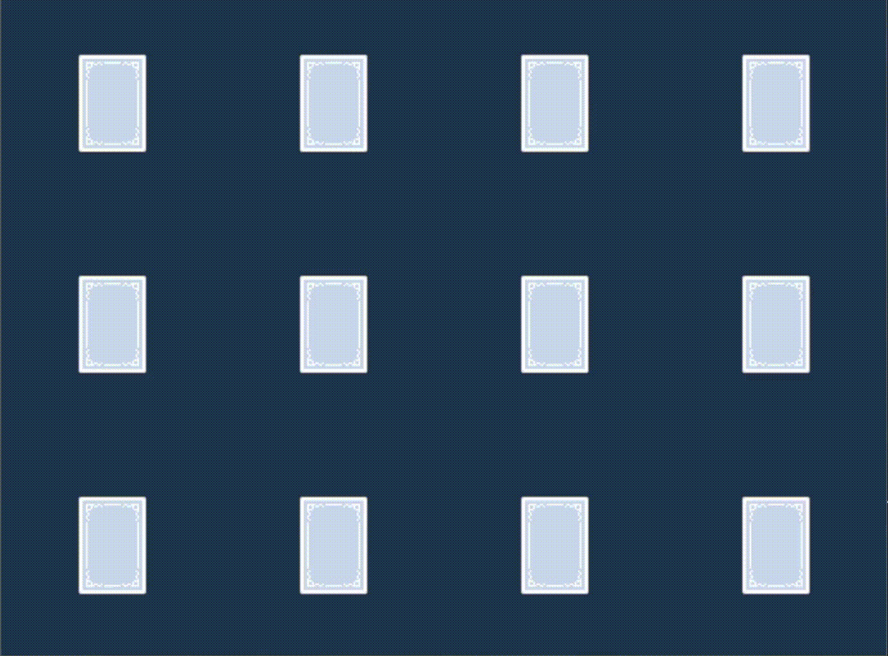
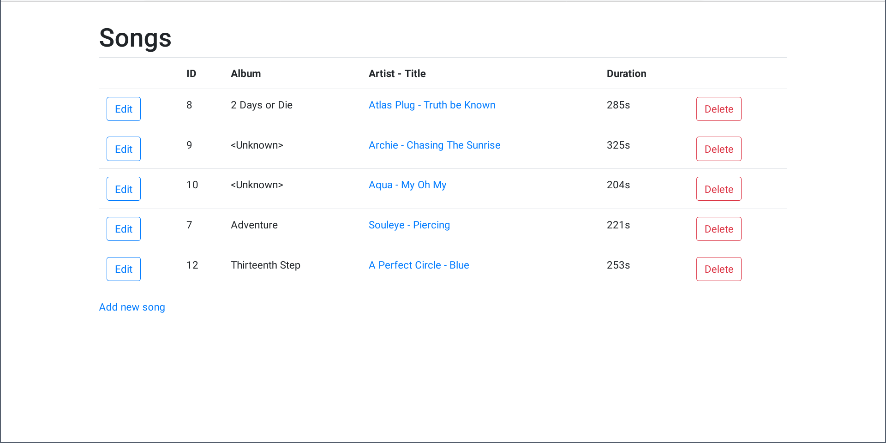
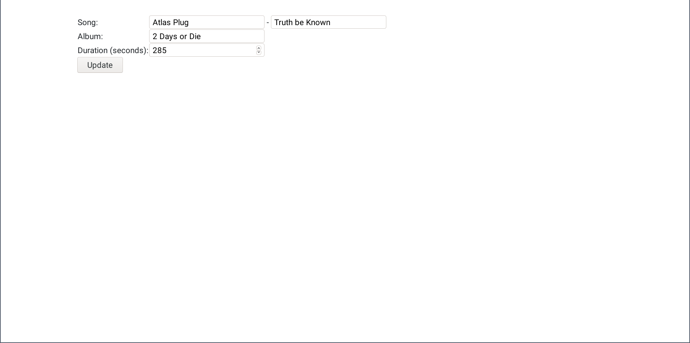

# Rust Projects

**TODO: Some of these are placeholders for now, until we gather up enough actual project demos**

- [Console](#console)
- [Desktop](#desktop)
- [Distributed](#distributed)
- [Games](#games)
- [Web](#web)

## Console

### Rust Shell

Source: https://github.com/luchev/rush

A working shell that passes all the compatibility tests from the [build-your-own-shell](https://github.com/tokenrove/build-your-own-shell) project.

## Desktop

### Brainfuck visualizer

Source: https://github.com/vtklisurov/RustProject

> This is a Brainfuck interpreter and visualizer, created for my Rust course in uni as a final project. Needs gtk-rs to work.

## Distributed

### Copper

Source: https://github.com/TsvetelinKostadinv/Copper

> The aim is to develop the infrastructure for distributed computing with Rust so a heavy task can be split between multiple computers.
>
> The application has 2 main components
>
> - Server, which accepts connections and sends out tasks
> - Client which receives the task, performs it and returns a result

## Games

### 5x5 Tic-tac-toe

Source: https://github.com/bhristova/rust/tree/master/project/tic_tac_toe

> This is an alternative version of the game Tic Tac Toe, where the board consists of 25 cells (5x5) and in order to win, you need to have four consecutive cells with your mark.

### Rust-shooter (placeholder)

Source: https://github.com/andrewradev/rust-shooter

A toy game in Rust. A pretty standard shooter, not a whole lot of extras.

Ideas for features:

- Levels
- Power-ups (text with different colors?)
- Different enemy movements

### Memory game (placeholder)

Source: https://github.com/AndrewRadev/rust-memory-game

Another toy game, with animations this time. Demonstrating both how animations could be tackled with GGEZ's built-in loop and how someone might interact with a "tabletop" game rather than a "shooter" game. Though the mouse interaction is, sadly, super hacky.

Ideas for features:

- An actual game. Right now it's just a board with random cards that flip.

## Web

### Spotiferris (placeholder)

Source: https://github.com/AndrewRadev/rust-spotiferris

| The song listing                                      | Editing a song                                        |
| --                                                    | --                                                    |
|  |  |

The beginnings of a music organization site.

Ideas for features:

- Uploading an actual mp3 file, parsing its metadata using [rust-id3](https://github.com/polyfloyd/rust-id3) and [rust-id3-image](https://github.com/andrewradev/id3-image)
- Playing an mp3 file, why not.
