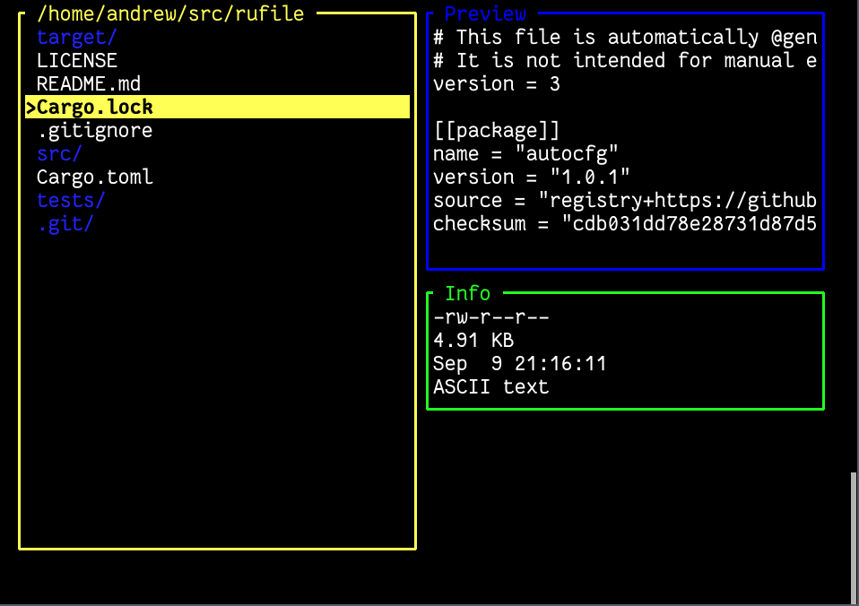
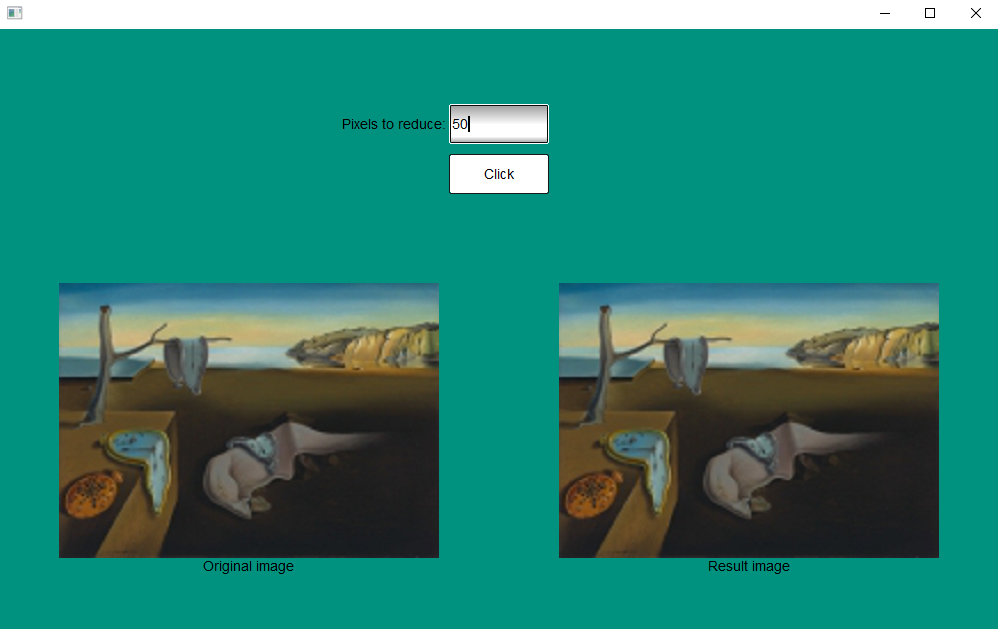
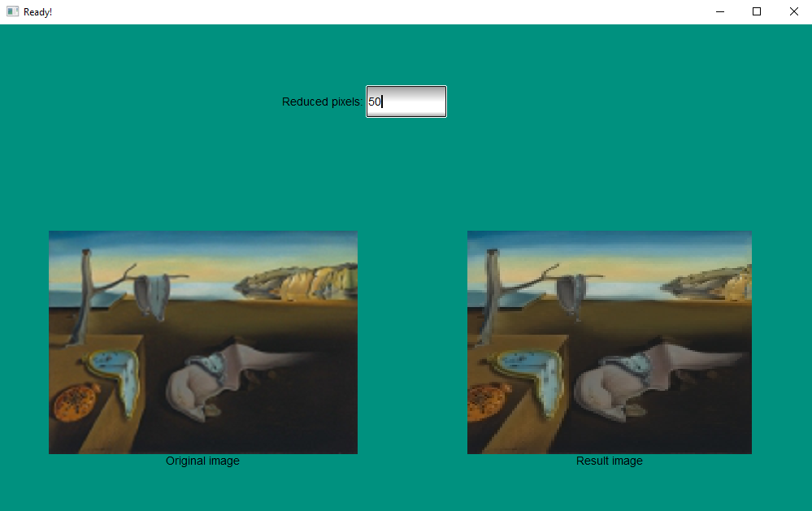
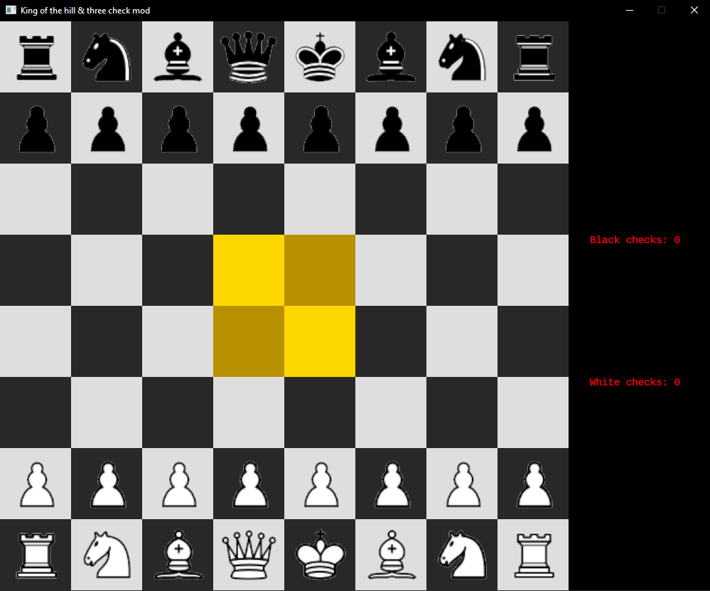

# Rust Projects

These are links to projects from the ["Programming with Rust"](https://fmi.rust-lang.bg/) course of the Sofia University in Bulgaria.

The elective course includes 23(ish) lectures spread out over 4 months or so. The students have homework assignments to practice Rust, and, at the end, present a project of their own choosing using the language. Here are some of them:

- [Console](#console)
- [Desktop](#desktop)
- [Distributed](#distributed)
- [Games](#games)

## Console

### Rgit (2021)

Source: <https://github.com/Stuksi/rgit>

A git-like version control system.

### Rust Shell (2020)

Source: <https://github.com/luchev/rush>

A working shell that passes all the compatibility tests from the [build-your-own-shell](https://github.com/tokenrove/build-your-own-shell) project.

### Yit (2020)

Source: <https://github.com/yzelova/Yit>

A git clone with support for branching, diffs and merges.

### Rufile (2020)

Source: <https://github.com/lachaka/rufile>

A console file manager with content previews and a Vim-like command-line.

## Desktop

### RustyEngine (2021)

Source: <https://github.com/NikiNatov/RustyEngine>

https://user-images.githubusercontent.com/124255/155875776-584054bc-ddd7-4365-a98a-c9d568bac555.mp4

A game engine that uses DirectX 11 for rendering as well as Win32 API for its other systems, making it support Windows OS only. Currently implemented features:

- Input and event systems
- Window system
- Model loading (currently FBX format only)
- PBR materials
- Image based lighting and HDR environment maps
- Scene system
- Level editor

### Brainfuck visualizer (2020)

Source: <https://github.com/vtklisurov/RustProject>

> This is a Brainfuck interpreter and visualizer, created for my Rust course in uni as a final project. Needs gtk-rs to work.

### Seam carving implementation (2020)

Source: <https://github.com/DannyStoyanov/seam-carving>

| Before                                  | After                                   |
| ---                                     | ---                                     |
|  |  |

> Seam-carving is an algorithm for content-aware image resizing. It allows image to be resized without losing important content from scaling or cropping.

## Distributed

### Copper (2020)

Source: <https://github.com/TsvetelinKostadinv/Copper>

> The aim is to develop the infrastructure for distributed computing with Rust so a heavy task can be split between multiple computers.
>
> The application has 2 main components
>
> - Server, which accepts connections and sends out tasks
> - Client which receives the task, performs it and returns a result

## Games

### Puker (2021)

Source: <https://github.com/PavelSarlov/puker>

https://user-images.githubusercontent.com/124255/155875841-ef592cc6-eb51-4451-968f-b19b04e4be48.mp4

A simple 2D game made with ggez, inspired by The Binding of Isaac.

### 5x5 Tic-tac-toe (2020)

Source: <https://github.com/bhristova/rust/tree/master/project/tic_tac_toe>

> This is an alternative version of the game Tic Tac Toe, where the board consists of 25 cells (5x5) and in order to win, you need to have four consecutive cells with your mark.

### Tetris with ggez (2020)

Source: <https://github.com/vasilp98/Tetris>

### Tetris with termion (2020)

Source: <https://github.com/nnyx7/tetris-cl>

### Boids (2020)

Source: <https://github.com/Ivaylogi98/boids_rust_project>

### Digger (2020)

Source: <https://github.com/Zarazen/digger>

### Become_Me (2020)

Source: <https://github.com/IvayloKiryazov/Become_Me>

> Become me is a turn-based strategy game with the goal of taking over the map through adapting, picking the right moment, and plotting with and against your fellow players.

### Tower defense (2020)

Source: <https://github.com/genchev99/rust-game>

### 2-Modded Chess (2020)

Source: <https://github.com/rejnhed/2-modded-chess>

> Chess with King of the hill & 3-Check written in Rust with ggez
