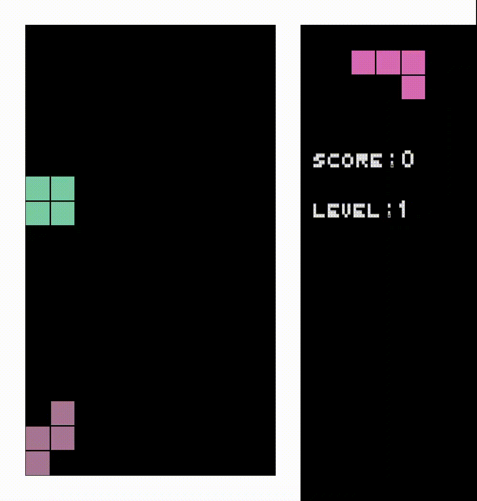

# Rust Projects

These are links to projects from the ["Programming with Rust"](https://fmi.rust-lang.bg/) course of the Sofia University in Bulgaria.

The elective course includes 23(ish) lectures spread out over 4 months or so. The students have homework assignments to practice Rust, and, at the end, present a project of their own choosing using the language. Here are some of them:

- [Console](#console)
- [Desktop](#desktop)
- [Distributed](#distributed)
- [Games](#games)

## Console

### Rust Shell

Source: https://github.com/luchev/rush

A working shell that passes all the compatibility tests from the [build-your-own-shell](https://github.com/tokenrove/build-your-own-shell) project.

### Yit

Source: https://github.com/yzelova/Yit

A git clone with support for branching, diffs and merges.

## Desktop

### Brainfuck visualizer

Source: https://github.com/vtklisurov/RustProject

> This is a Brainfuck interpreter and visualizer, created for my Rust course in uni as a final project. Needs gtk-rs to work.

## Distributed

### Copper

Source: https://github.com/TsvetelinKostadinv/Copper

> The aim is to develop the infrastructure for distributed computing with Rust so a heavy task can be split between multiple computers.
>
> The application has 2 main components
>
> - Server, which accepts connections and sends out tasks
> - Client which receives the task, performs it and returns a result

## Games

### 5x5 Tic-tac-toe

Source: https://github.com/bhristova/rust/tree/master/project/tic_tac_toe

> This is an alternative version of the game Tic Tac Toe, where the board consists of 25 cells (5x5) and in order to win, you need to have four consecutive cells with your mark.

### Tetris (ggez)

Source: https://github.com/vasilp98/Tetris

### Tetris (termion)

Source: https://github.com/nnyx7/tetris-cl

### Boids

Source: https://github.com/Ivaylogi98/boids_rust_project

### Digger

Source: https://github.com/Zarazen/digger

### Become_Me

Source: https://github.com/IvayloKiryazov/Become_Me

> Become me is a turn-based strategy game with the goal of taking over the map through adapting, picking the right moment, and plotting with and against your fellow players.
