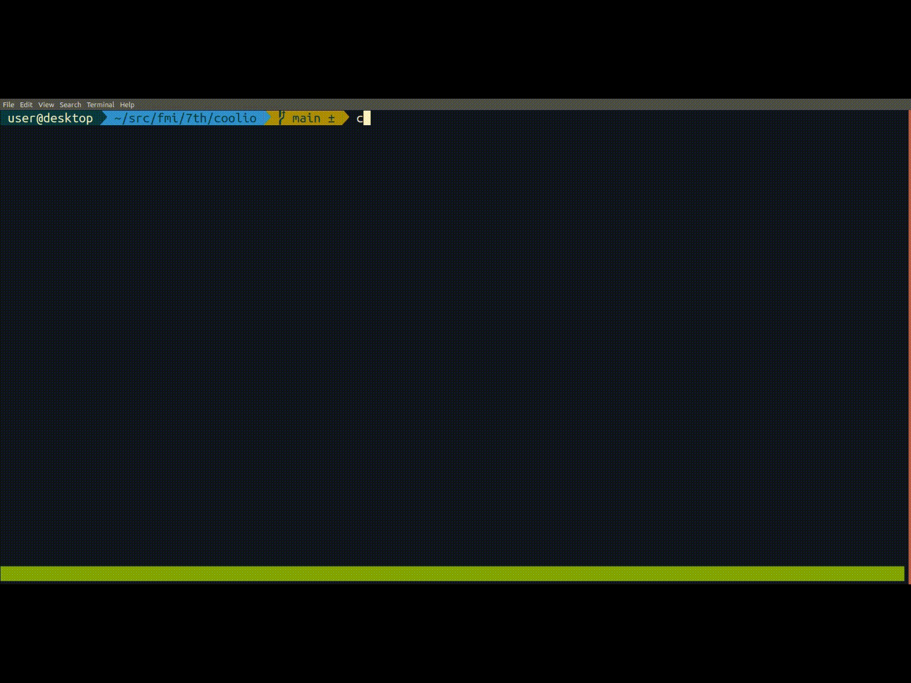

# Rust Projects

These are links to projects from the ["Programming with Rust"](https://fmi.rust-lang.bg/) course of the Sofia University in Bulgaria.

The elective course includes 23(ish) lectures spread out over 4 months or so. The students have homework assignments to practice Rust, and, at the end, present a project of their own choosing using the language. Here are some of them:

- [Console](#console)
- [Desktop](#desktop)
- [Distributed](#distributed)
- [Games](#games)

## Console

### tonkobali (2024)

Source: <https://gitlab.com/Syndamia/tonkobali>

https://github.com/user-attachments/assets/40acc0c0-0399-467c-a427-afb0321b9cc5

A small [SUBLEQ](https://en.wikipedia.org/wiki/One-instruction_set_computer#Subtract_and_branch_if_less_than_or_equal_to_zero)-based virtual machine and assembler for it.

### lambda-script (2022)

Source: <https://github.com/NikolayDPaev/lambda-script>

https://user-images.githubusercontent.com/124255/226177720-b5d824de-baa7-4ad8-be5b-28664aa2f31a.mp4

Interpreter for a Custom Functional Programming language with lazy evaluation

### Rgit (2021)

Source: <https://github.com/Stuksi/rgit>

A git-like version control system.

### Coolio (2021)

Source: <https://github.com/pepilipep/coolio>

coolio is a CLI tool which enables some extra features for your Spotify. Features:

- Automated playlists for artists
- Listen history tracking

### Rust Shell (2020)

Source: <https://github.com/luchev/rush>

A working shell that passes all the compatibility tests from the [build-your-own-shell](https://github.com/tokenrove/build-your-own-shell) project.

### Yit (2020)

Source: <https://github.com/yzelova/Yit>

A git clone with support for branching, diffs and merges.

### Rufile (2020)

Source: <https://github.com/lachaka/rufile>

A console file manager with content previews and a Vim-like command-line.

## Desktop

### RustyEngine (2021)

Source: <https://github.com/NikiNatov/RustyEngine>

https://user-images.githubusercontent.com/124255/155875776-584054bc-ddd7-4365-a98a-c9d568bac555.mp4

A game engine that uses DirectX 11 for rendering as well as Win32 API for its other systems, making it support Windows OS only. Currently implemented features:

- Input and event systems
- Window system
- Model loading (currently FBX format only)
- PBR materials
- Image based lighting and HDR environment maps
- Scene system
- Level editor

### ImageEditor (2021)

Source: <https://github.com/nadezhda1120/ImageEditor>

https://user-images.githubusercontent.com/124255/157017477-ea3421e3-f7cc-4c7d-94c6-cf8d7263096f.mp4

### Brainfuck visualizer (2020)

Source: <https://github.com/vtklisurov/RustProject>

> This is a Brainfuck interpreter and visualizer, created for my Rust course in uni as a final project. Needs gtk-rs to work.

### Seam carving implementation (2020)

Source: <https://github.com/DannyStoyanov/seam-carving>

| Before                                  | After                                   |
| ---                                     | ---                                     |
|  |  |

> Seam-carving is an algorithm for content-aware image resizing. It allows image to be resized without losing important content from scaling or cropping.

## Distributed

### Copper (2020)

Source: <https://github.com/TsvetelinKostadinv/Copper>

> The aim is to develop the infrastructure for distributed computing with Rust so a heavy task can be split between multiple computers.
>
> The application has 2 main components
>
> - Server, which accepts connections and sends out tasks
> - Client which receives the task, performs it and returns a result

## Games

### Domino game (2022)

Source: <https://github.com/VladimirRadev/domino_game>

https://user-images.githubusercontent.com/35682499/216770243-ead82af7-3158-4964-b7d4-fc9fbb1dbb0d.mp4

> A 2D game imitating <https://galactical.itch.io/the-boneyard> created with the ggez library

### Solitaire (2022)

Source: <https://github.com/YondaimeHokage7/Solitaire>

### Tank game (2022)

Source: <https://gitlab.com/ybi-portfolio/tank-game>

https://user-images.githubusercontent.com/124255/224557348-41cc9fc1-39d7-47b6-be60-cfb7b77916d7.mp4

> A multiplayer(websocket-based) top-down shooter game with tanks. Bots automatically spawn if there are not enough players in the room. The twist is that whenever you kill someone, you steal their score and your health gets fully restored.

### Typing tutor (2022)

Source: <https://github.com/nixann/typing-tutor>

https://user-images.githubusercontent.com/124255/224551635-2c0cc956-76df-471f-9016-e91f765f784f.mov

### Puker (2021)

Source: <https://github.com/PavelSarlov/puker>

https://user-images.githubusercontent.com/124255/155875841-ef592cc6-eb51-4451-968f-b19b04e4be48.mp4

A simple 2D game made with ggez, inspired by The Binding of Isaac.

### Blackjack (2021)

Source: <https://github.com/KristiyanCvetanov/Blackjack>

A simple Blackjack game on Rust using the ggez framework. You play 1vs1 against the dealer with standard blackjack rules, but there are added "power-ups" to help you win.

### Flappy Ferris (2021)

Source: <https://github.com/geosabev/FMI-Rust-2021-2022/tree/main/flappy-ferris>

This game is made with ggez and is based on the famous Flappy Bird that was a total hit a couple of years ago.

### Jet Fighter (2021)

Source: <https://github.com/AngelMarinski/FMI-Rust/tree/main/Jet-Fighter>

https://user-images.githubusercontent.com/77447043/155611425-24e76ffa-a258-45a3-bef0-1f5628e571d7.mp4

Jet Fighter is an old arcade game played by two. The winner is whoever shoots their opponent 5 times first.

### Rust-snek (2021)

Source: <https://github.com/teodorask/rust-snek>

https://user-images.githubusercontent.com/124255/156885872-b1158347-518e-4954-9b09-e6e8f877ce02.mp4

> You're playing as a snake livng on a small hexagonal island in the The Big Void. You're lonely and hungry. There's no one else there with you, but there's always exactly one apple. You're goal is to roam the land and eat as many as you can. But beware of the island edges - once you fall you're journey's over! You hope that once you become bigger and stronger you could finally leave. But you'll soon find out that that has its consequences too...

### Connect four (2021)

Source: <https://github.com/secretuser234/connectfour>

https://user-images.githubusercontent.com/124255/156896981-8a20e0c0-8dda-45c7-a504-41de001f01cb.mp4

### Type racer (2021)

Source: <https://github.com/Gordss/type_racer>

https://user-images.githubusercontent.com/124255/156929615-f714be53-53b2-4ae4-8b72-5575782d30c9.mp4

> Words are coming from the left side of the screen and go to the right. The player should write the incoming words without typo and earn points. If you leave a word to get to the right side of the screen you lose 1 life. If you lose all of your lives -> Game Over :/. The question is how far can you get and how much points you can earn? :)

### Extreme tetris (2021)

Source: <https://github.com/EnevMk/Extreme-tetris>

https://user-images.githubusercontent.com/124255/156939358-2b2997ef-40dd-494f-ae51-72327b46bad7.mp4

A little tetris-like game with some tweaks and additional logic, written in Rust.

### 5x5 Tic-tac-toe (2020)

Source: <https://github.com/bhristova/rust/tree/master/project/tic_tac_toe>

> This is an alternative version of the game Tic Tac Toe, where the board consists of 25 cells (5x5) and in order to win, you need to have four consecutive cells with your mark.

### Tetris with ggez (2020)

Source: <https://github.com/vasilp98/Tetris>

### Tetris with termion (2020)

Source: <https://github.com/nnyx7/tetris-cl>

### Boids (2020)

Source: <https://github.com/Ivaylogi98/boids_rust_project>

### Digger (2020)

Source: <https://github.com/Zarazen/digger>

### Become_Me (2020)

Source: <https://github.com/IvayloKiryazov/Become_Me>

> Become me is a turn-based strategy game with the goal of taking over the map through adapting, picking the right moment, and plotting with and against your fellow players.

### Tower defense (2020)

Source: <https://github.com/genchev99/rust-game>

### 2-Modded Chess (2020)

Source: <https://github.com/rejnhed/2-modded-chess>

> Chess with King of the hill & 3-Check written in Rust with ggez
