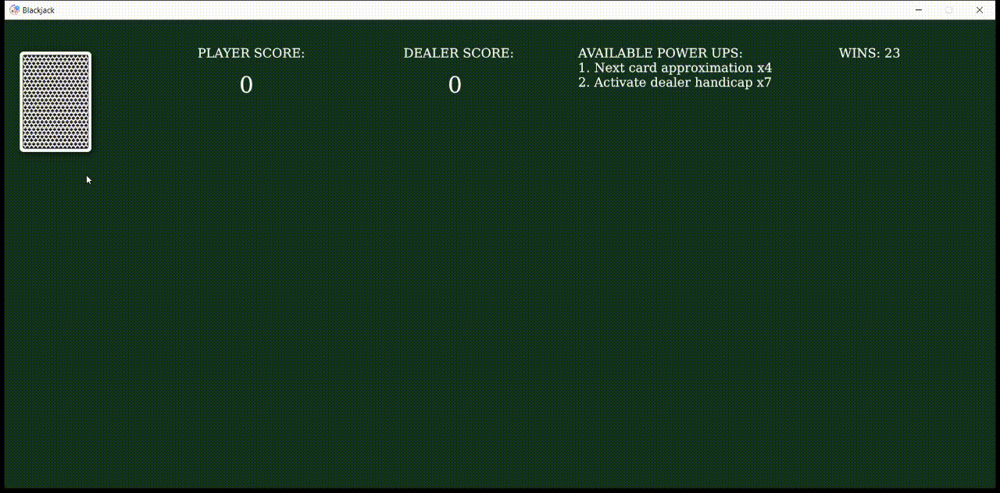

# Rust Projects from Semester 2021/2022

- [Console](#console)
- [Desktop](#desktop)
- [Games](#games)

## Console

### Rgit

Source: <https://github.com/Stuksi/rgit>

A git-like version control system.

## Desktop

### RustyEngine

Source: <https://github.com/NikiNatov/RustyEngine>

https://user-images.githubusercontent.com/124255/155875776-584054bc-ddd7-4365-a98a-c9d568bac555.mp4

A game engine that uses DirectX 11 for rendering as well as Win32 API for its other systems, making it support Windows OS only. Currently implemented features:

- Input and event systems
- Window system
- Model loading (currently FBX format only)
- PBR materials
- Image based lighting and HDR environment maps
- Scene system
- Level editor

## Games

### Puker

Source: <https://github.com/PavelSarlov/puker>

https://user-images.githubusercontent.com/124255/155875841-ef592cc6-eb51-4451-968f-b19b04e4be48.mp4

A simple 2D game made with ggez, inspired by The Binding of Isaac.

### Blackjack

Source: <https://github.com/KristiyanCvetanov/Blackjack>

A simple Blackjack game on Rust using the ggez framework. You play 1vs1 against the dealer with standard blackjack rules, but there are added "power-ups" to help you win.

### Flappy Ferris

Source: <https://github.com/geosabev/FMI-Rust-2021-2022/tree/main/flappy-ferris>

This game is made with ggez and is based on the famous Flappy Bird that was a total hit a couple of years ago.
